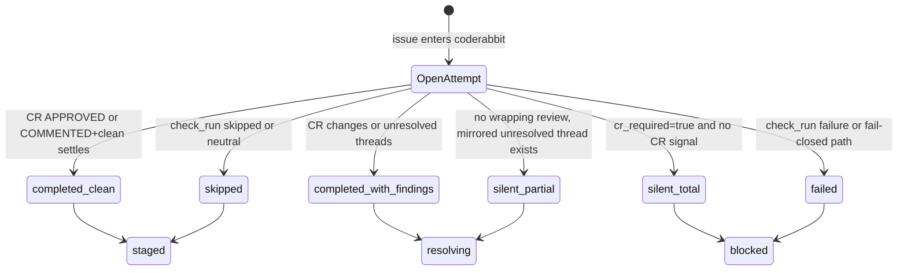

# CodeRabbit Integration

Multica's CR loop waits for CodeRabbit's wrapping `pull_request_review.submitted`
event before changing issue status. Per-comment and per-thread webhooks mirror
review data into local tables; they do not route cards.

## Flow



`coderabbit` is the only status where CR v2 review events drive transitions.
CR findings route to `resolving`; clean approval routes to `staged`.

## Event Matrix

| GitHub event | v2 behavior |
| --- | --- |
| `pull_request_review.submitted` by CR, `CHANGES_REQUESTED` | close attempt as `completed_with_findings`, route to `resolving` |
| `pull_request_review.submitted` by CR, `COMMENTED` with unresolved local threads | close attempt as `completed_with_findings`, route to `resolving` |
| `pull_request_review.submitted` by CR, `APPROVED` and clean predicate | close attempt as `completed_clean`, route to `staged` |
| `pull_request_review.submitted` by CR, `COMMENTED` and clean predicate | record open attempt; settle sweeper re-checks after timeout |
| `pull_request_review_comment` | mirror only |
| `pull_request_review_thread` | mirror state only; records a signal when local mirrored comments identify CR as author |
| `check_run` by CodeRabbit | records a signal; failure closes `failed` to `blocked`; skipped/neutral closes `skipped` to `staged` |
| `issue_comment` by CodeRabbit on a PR | records a signal without changing the attempt head SHA |

## Attempt Lifecycle

`cr_review_attempt` is the per-round source of truth. Wrapping review events
upsert the current round, record review state, and either close the attempt or
leave it open for COMMENTED+clean settling.

Closed attempts can have one of six outcomes:

- `completed_clean`: CR approved or a clean COMMENTED review survived the settle window.
- `completed_with_findings`: CR requested changes or local CR threads are unresolved.
- `silent_partial`: the no-review sweeper found mirrored unresolved CR threads but no wrapping review.
- `silent_total`: no CR signal arrived before `MULTICA_CR_NO_REVIEW_SECS` and `workspace_repo_binding.cr_required=true`.
- `failed`: CR check-run or a fail-closed path blocked the issue.
- `skipped`: CR check-run concluded `skipped` or `neutral`.

The post-comment settle sweeper reads open `review_state='commented'` attempts
whose issue is still in `coderabbit`, re-checks CodeRabbit's live predicate via
the GitHub App installation, then closes the attempt as:

- `completed_clean` and routes to `staged` when still clean.
- `completed_with_findings` and routes to `resolving` if late comments or open
  changes are present.

## Signals

`cr_review_signal` is the append-only observability stream for a
`cr_review_attempt`. Each row belongs to one attempt through `attempt_id` and
captures:

- `signal_kind`: one of `check_run`, `issue_comment`, `review_comment`,
  `review`, or `thread`.
- `signal_action`: the GitHub action when present, such as `created`,
  `submitted`, or `completed`.
- `received_at`: when Multica recorded the signal.
- `payload_summary`: a compact JSON summary for UI/debugging, not the full
  webhook payload.

D16 dedup is intentionally at the webhook-delivery boundary: signals are 1:1
with successful `github_webhook_delivery` handling. A redelivered webhook that
is rejected by delivery dedup does not add another signal. The attempt columns
`first_signal_at` and `first_signal_kind` are set only once, by the first
successful signal recorded for that round.

## Silent Handling

The silence sweeper reads stale `coderabbit` issues with no first signal:

- `cr_required=true`: closes `silent_total`, routes to `blocked`, and posts one
  `<!-- sidecar-block -->` system comment.
- `cr_required=false`: closes `completed_clean`, routes to `staged`, writes no
  `sidecar-block`, and writes the per-round attempt audit comment.
- unresolved mirrored CR threads with no wrapping review close
  `silent_partial` and route to `resolving`.

`silent_total` intentionally skips `<!-- sidecar-cr-attempt -->` because the
blocking `<!-- sidecar-block -->` comment is the audit artifact for that path.

## Audit Comments

Terminal non-blocking attempt closures write one per-round
`<!-- sidecar-cr-attempt -->` system comment inside the same transaction that
closes the attempt and routes the issue. COMMENTED+clean wrapping reviews leave
the attempt open and write no attempt audit comment until the settle sweeper
closes it.

Fail-closed paths write exactly one `<!-- sidecar-block -->` comment and do not
also write a `<!-- sidecar-cr-attempt -->` comment.

## Tunables

- `MULTICA_CR_SWEEP_INTERVAL_SECS=60`: shared CR sweeper tick interval.
- `MULTICA_CR_SETTLE_SECS=300`: legacy silent-comment settle window.
- `MULTICA_CR_POST_COMMENT_SETTLE_SECS=120`: COMMENTED+clean settle window.
- `MULTICA_CR_NO_REVIEW_SECS=1800`: silent-total window before a `coderabbit` issue is blocked, unless the repo binding has `cr_required=false`.
- `workspace_repo_binding.cr_required`: per-repository switch. When false,
  silence is treated as clean completion instead of a block.

## Diagnostics

```sql
SELECT i.id, i.title, i.status, i.updated_at,
       a.cr_round, a.review_state, a.review_submitted_at, a.outcome
FROM issue i
LEFT JOIN cr_review_attempt a ON a.issue_id = i.id
  AND a.cr_round = (SELECT MAX(cr_round) FROM cr_review_attempt WHERE issue_id = i.id)
WHERE i.status IN ('coderabbit', 'resolving');
```

```sql
SELECT id, file_path, line, severity, state, processed_by_resolver_at
FROM issue_review_thread
WHERE issue_id = $1
ORDER BY CASE severity
  WHEN 'issue' THEN 0
  WHEN 'refactor' THEN 1
  WHEN 'suggestion' THEN 2
  WHEN 'nitpick' THEN 3
  ELSE 4
END, file_path, line;
```
